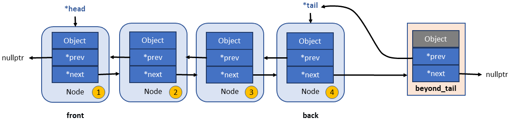
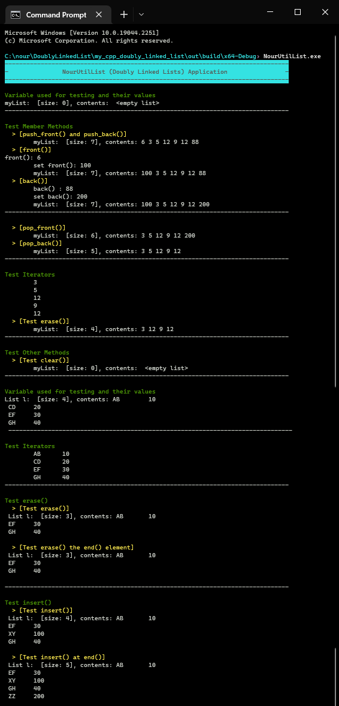

# my_cpp_doubly_linked_list
> Implementation of Own String Class
 
 In this presents an implementation of a class named `util::list`. This class behavior is a simplified implementation of the `std::list`. Class `list` represents a container which organizes stored objects with a so-called doubly linked list. A doubly linked list is basically a list of nodes which are connected among each other.

 The doubly linked list data structure is implemented as shown in the following figure:

For each object that is to be stored, a new node is internally created by class `list`. Besides the object to store, each node has two pointers; `prev` and `next`. `prev` points to the previous node, `next` points to the next node.

The first node (`head`) and last node (`tail`) are special nodes since in these cases `prev` or `next` do not point to a predecessor or successor. When adding the first object to the list, an initial node is being created which represents the first and last node at the same time.

Another special node is the `beyond_tail` node. It is a a placeholder node which is the successor of the last node stored in the list. The main purpose of this node is to be used by the method `end()` to return an iterator with it. That is to conform with the STL container conventions that never returns an iterator pointing to a valid (last) object. As this element acts as a placeholder/sentinel, any attempt to access its object results in undefined behavior.

Full and detailed examples of uses and tests of the class `util::list` are given in the `main.cpp` file. Each method and operator is very carefully tested (e.g., calling pop_front() on an empty list, ..., etc.).

An example test run is shown in the following screenshot:

Note that the **terminal output is colored** (using [ANSI escape codes](https://en.wikipedia.org/wiki/ANSI_escape_code)) for better visibility.

**Doxygen** generated documentation (in html and LaTeX formats) can be found at [`doc/html/index.html`](doc/html/index.html) and [`doc/latex/refman.pdf`](doc/latex/refman.pdf), respectively. The configuration file `Doxyfile` is used with the Doxygen generation tool.

## Design and Implementation Criteria:
The following design and implementation criteria are followed:
* **No C/C++ standard functions or classes are used** to realize `util::list` class. This include, e.g., `size()`, `push_back()` and of course using `std::list` or similar as an internal representation of `util::list`.
  * This means own functions/methods are developed and implemented to do all required operations.
*  Class `util::list` is made generic such that any type can be stored within its nodes.
• The class has a **default constructor** that initializes it to an empty list.
* For now, **error handling** is implemented in a simplified fashion. The `util::list` class implements an exception-based error handling for various error cases. Example: Calling `pop_front()` on an empty list shall result in an appropriate exception. Note that some errors may not be handled. This may be done later. **Use this class at your own risk** :).
* The code follows [LLVM Coding Standards](https://llvm.org/docs/CodingStandards.html).
* The *[sanke_case](https://en.wikipedia.org/wiki/Snake_case)* naming convention is used for variable and function names (with few exceptions).

* :fire: **Use this class at your own risk** :fire: :).

 ## General Functionality
* The class `util::list` is implemented inside the two files `utillist.cpp` and `utillist.h`
* Class list is within the namespace `util`.

## Iterator Concept
To allow iterating `util::list`, a simplified version of the iterator concept is implemented. the class `iterator` as a so-called nested class is added to the to the public part of `util::list`. THe following functionality is implemented for this `iterator`:

* `operator==`: Two iterators are equal if they point to the same node
* `operator!=`: Two iterators are equal if they point to different nodes
* `operator++`: Point/Go to the next node element. Both **prefix and postfix** variants are supported.
* `operator*`: Return a reference to the object stored in the current node
* `operator->`: Return a pointer to the object stored in the current node

## Constructors
The following constructors are implemented:
* `list()` : Default constructor with empty initialization. This **default constructor** that initializes it to an empty list.

## Operators
The following operators are implemented:
* `operator <<` Streaming operator << to print `util::list` elements and some information (size) to `std::cout`.

## Methods
The following methods are implemented:

* `T& front()`: Gives access to the first element of the list
* `T& back()`: Gives access to the last element of the list
* `empty()`: Returns true, if the list does not contain elements
* `size()`: Returns the amount of stored objects
* `clear()`: Clears the list
* `void push_back(const T& element)`: Adds element to the end of the list
* `void pop_back()`: Removes the last element from the list
* `void push_front(const T& element)`: Adds element to the front of the list
* `void pop_front`:  Removes the first element from the list
* `display()`: print the list elements and size to the standard `outstream`
* `begin()`: Returns an iterator which points to the first element of the list
* `end()`: Returns a special iterator which points to a placeholder node (`beyond_tail`) which is the successor of the last node stored in the list.

Notes for the above methods and to follow the spirit of how class std::list behavior.
:
* `T` represents the actual type, not a node.
* when calling `front()` and `back()`, they do not return nodes. 
* `push_front()` or `push_back()` do not taking nodes as arguments. They take the actual data element.

## Extra Functions and Utilities
Some extra (non-member) functions and utilities are implemented (in the header file `my_extras.h`) that help for better functionality and output. These functions are:

* `printHeader(const char* text)`,\
  `printSubHeader(const char* text)`,\
  `printTestCase(const char* text)` : \
  To print a nicely formatted and colored text header, sub header, title header, respectively to the terminal

## References
* Standard list library : https://en.cppreference.com/w/cpp/container/list
* C++ ISO Standard https://isocpp.org/std/the-standard
* C++ documentation - DevDocs : https://devdocs.io/cpp/
* LLVM Coding Standards: https://llvm.org/docs/CodingStandards.html
* sanke_case convention : https://en.wikipedia.org/wiki/Snake_case
* Markdown Basic Syntax : https://www.markdownguide.org/basic-syntax
* Doxygen : https://www.doxygen.nl/index.html